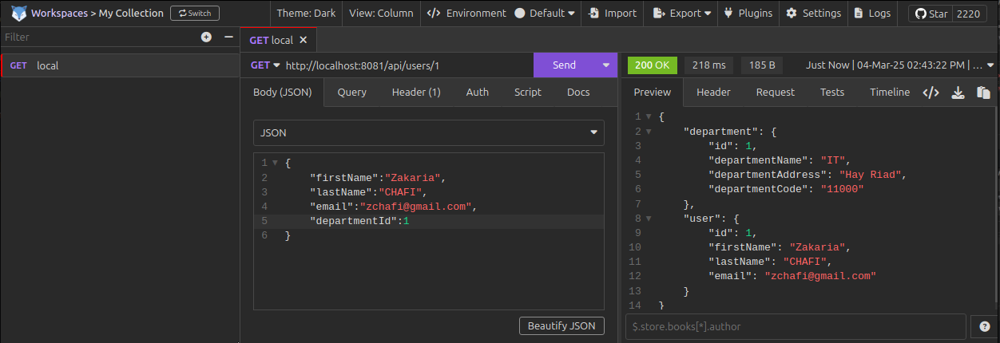

# Spring Boot Microservices Communication Example using WebClient

As of 5.0, the RestTemplate class is in maintenance mode and soon will be deprecated. So the Spring team recommended using org.springframework.web.reactive.client.WebClient that has a modern API and supports sync, async, and streaming scenarios.

In this tutorial, we will learn how to use WebClient to make REST API calls (Synchronous communication) between multiple microservices.

WebClient is a non-blocking, reactive client to perform HTTP requests, exposing a fluent, reactive API over underlying HTTP client libraries such as Reactor Netty.

To use WebClient in our Spring boot project, we have to add Spring WebFlux dependency to the classpath.

`<dependency> <groupId>org.springframework.boot</groupId> <artifactId>spring-boot-starter-webflux</artifactId> </dependency>
`
  
# Getting Started

# API DepartmentService

### DepartmentService - Start Spring Boot Application
From the root directory of the application and type the following command to run  :

`mvn clean install
`
`mvn spring-boot:run
`
by default port server 8080

### DepartmentService - Test REST APIs using Postman Client

# UserService - Test REST APIs using Postman Client
From the root directory of the application and type the following command to run  :

`mvn clean install
`
`mvn spring-boot:run
`
with port 8081

--------------------

---------------------------------
### Reference Documentation
For further reference, please consider the following sections:

* [Official Apache Maven documentation](https://maven.apache.org/guides/index.html)
* [Spring Boot Maven Plugin Reference Guide](https://docs.spring.io/spring-boot/3.4.3/maven-plugin)
* [Create an OCI image](https://docs.spring.io/spring-boot/3.4.3/maven-plugin/build-image.html)
* [Spring Web](https://docs.spring.io/spring-boot/3.4.3/reference/web/servlet.html)
* [Spring Data JPA](https://docs.spring.io/spring-boot/3.4.3/reference/data/sql.html#data.sql.jpa-and-spring-data)

### Guides
The following guides illustrate how to use some features concretely:

* [Building a RESTful Web Service](https://spring.io/guides/gs/rest-service/)
* [Serving Web Content with Spring MVC](https://spring.io/guides/gs/serving-web-content/)
* [Building REST services with Spring](https://spring.io/guides/tutorials/rest/)
* [Accessing Data with JPA](https://spring.io/guides/gs/accessing-data-jpa/)
* [Accessing data with MySQL](https://spring.io/guides/gs/accessing-data-mysql/)

### Maven Parent overrides

Due to Maven's design, elements are inherited from the parent POM to the project POM.
While most of the inheritance is fine, it also inherits unwanted elements like `<license>` and `<developers>` from the parent.
To prevent this, the project POM contains empty overrides for these elements.
If you manually switch to a different parent and actually want the inheritance, you need to remove those overrides.
